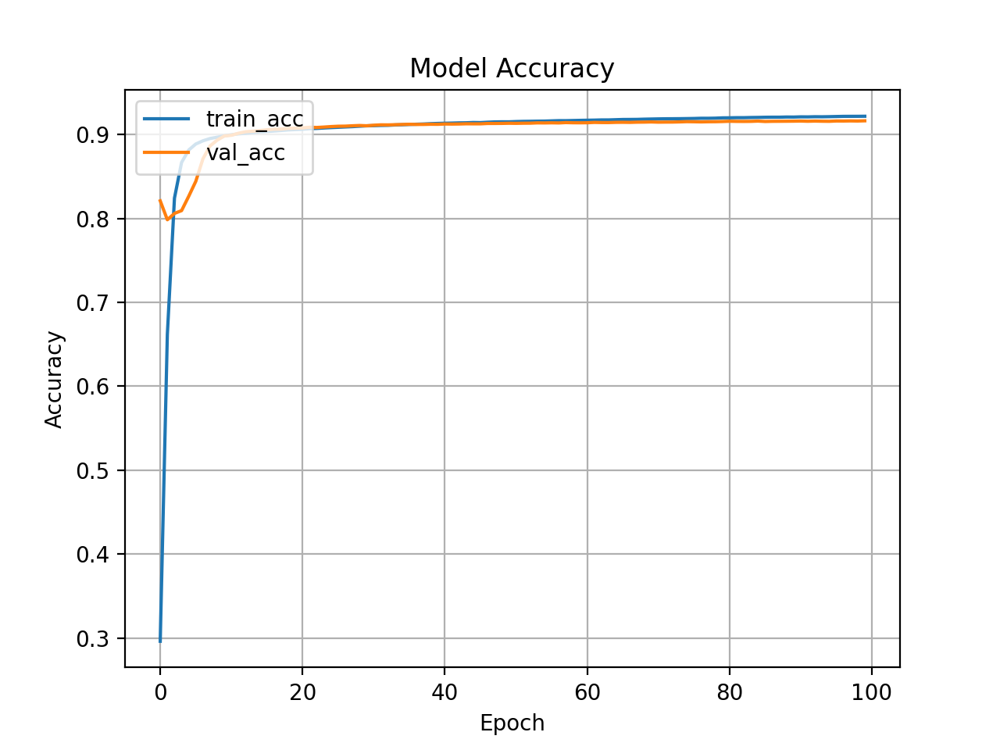
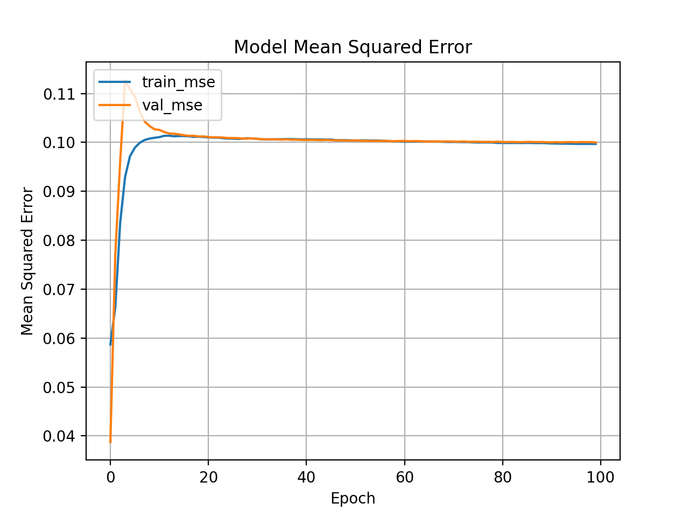

# DCBLSTM-PSP: Secondary Protein Structure Prediction using Deep Learning #

[](https://pypi.org/project/pySAR/)
[](https://pypi.org/project/pySAR/)
[](https://github.com/amckenna41/DCBLSTM/actions)
[](https://app.travis-ci.com/amckenna41/DCBLSTM_PSP)
[](https://opensource.org/licenses/MIT)
[](https://github.com/amckenna41/DCBLSTM_PSP/issues)
[](https://github.com/amckenna41/DCBLSTM_PSP)
[](https://github.com/DCBLSTM_PSP)

Table of Contents
-----------------

  * [Introduction](#introduction)
  * [Approach and implementation](#approach)
  * [Datasets](#datasets)
  * [Conclusions and Results](#conclusions-and-results)
  * [Requirements](#requirements)
  * [Installation](#installation)
  * [Usage](#usage)
  * [Cloud Distribution](#cloud-distribution)
  * [Directory Folders](#directory-folders)
  * [Output Directory Structure](#output-directory-structure)
  * [Tests](#tests)
  * [Open Issues](#Issues)
  * [Contact](#contact)
  * [References](#references)


Introduction
------------
Protein Structure Prediction (PSP) is the determination of a protein's structure from its initial primary amino acid sequence. Here we focus on secondary protein structure prediction (SPSP) which acts as an intermediate between the primary and tertiary. PSP is one of the most important goals in the field of bioinformatics and remains highly important in the field of medicine and biotechnology, e.g in drug design and environmental stability [[1]](#references) [[2]](#references). The secondary structure is commonly broken down into 8 categories:

* alpha helix ('H')
* beta strand ('E')
* loop or irregular ('L')
* beta turn ('T')
* bend ('S')
* 3-helix (3-10 helix) ('G')
* beta bridge ('B')
* 5-helix (pi helix) ('I')

Proteins are made up of one or more polypeptide chains of amino acid residues. The constituent amino acids are bonded together by peptide bonds. Proteins have a variety of roles within organisms including enzymes, cell signalling and ligand binding, immune response through antibodies and the various roles fulfilled via structural proteins [[3]](#references). Most proteins fall into the category of 4 structures. The primary structure is simply the sequence of amino acids, the secondary structure is recurring arrangements of adjacent amino acids in a polypeptide chain, tertiary structure is the 3-dimensional representation of a protein consisting of a polypeptide chain/backbone with 1 or more secondary protein structures [[4]](#references), quaternary structure is when a protein consists of more than one polypeptide chain [[5]](#references). A visualisation of these structures can be seen below.

<br>
<p align="center">

</p>

Approach and implementation
---------------------------

Many different machine learning approaches for implementing effective PSP have been proposed which have included Convolutional Neural Nets, SVM's, random forests, KNN, Hidden Markov Models etc [[6, 7, 8, 9, 10]](#references). There has also been much recent research with the utilisation of recurrent neural nets, specifically using GRU's (Gated Recurrent Units) and LSTM's (Long-Short-Term-Memory) [[11, 12]](#references). These recurrent components help map long-distance dependancies in the protein chain, whereby an amino acid may be influenced by a residue much earlier or later in the sequence, this can be attributed to the complex protein folding process. An LSTM cell is made up of 3 gates - input, output and forget [[13]](#references). The forget gate decodes what information the should 'forget' or not. The input gate updates the cell state and output gate controls the extent to which a value in the cell is used to compute the output activation of the LSTM. <br>

<p align="center">

</p>
<!--  -->


Bidirectional LSTM's which allow for the LSTM unit to consider the protein sequence in the forward and backward direction. Additionally, to map local dependancies and context between adjacent residues, a CNN preceded the recurrent component of the model where 1-Dimensional convolutional layers were used.
Optimisation and regularisation techniques were applied to the model to maximise performance and efficiency.


This PSP project was implemented using the Keras API which is a deep learning API that runs on top of the TensorFlow machine learning framework. The model consisted of 3 main components, a 1-Dimensional CNN for capturing local context between adjacent amino acids, a bidirectional LSTM RNN for mapping long distance dependancies within the sequence and a deep fully-connected network used for dimensionality reduction and classification. The design of the model can be seen below:

<p align="center">

</p>

Datasets
--------
### Training
The training datasets used in this project are taken from the ICML 2014 Deep Supervised and Convolutional Generative Stochastic Network paper [[1]](#references). The datasets in this paper were created using the PISCES protein culling server, that is used to cull protein sequences from the protein data bank (PDB) [[14]](#references). As of Oct 2018, an updated dataset, with any of the duplicated in the previous __6133 dataset removed, has been release called cullpdb+profile_5926.
Both of the datasets contain a filtered and unfiltered version. The filtered version is filtered to remove any redundancy with the CB513 test dataset. The unfiltered datasets have the train/test/val split whilst for filtered, all proteins can be used for training and test on CB513 dataset. Both filtered and unfiltered dataset were trained and evaluated on the models.  
<br>
More about the composition of the training datasets including the reshaping and features used can be found here:
https://www.princeton.edu/~jzthree/datasets/ICML2014/dataset_readme.txt

These datasets are available at:
https://www.princeton.edu/~jzthree/datasets/ICML2014/

### Test

Three datasets were used for evaluating the models created throughout this project:

- CB513
- CASP10
- CASP11

The CB513 dataset is available at:
https://www.princeton.edu/~jzthree/datasets/ICML2014/

The CASP10 and CASP11 datasets were taken from the biennial CASP (Critical Assessment of Techniques for Protein Structure Prediction) competition, more info about them can be seen on:
https://predictioncenter.org/casp10/index.cgi
https://predictioncenter.org/casp11/index.cgi

The CASP10 and CASP11 datasets are available at:
https://drive.google.com/drive/folders/1404cRlQmMuYWPWp5KwDtA7BPMpl-vF-d OR
https://github.com/amckenna41/DCBLSTM_PSP/tree/master/psp/data/casp10.h5 &
https://github.com/amckenna41/DCBLSTM_PSP/tree/master/psp/data/casp11.h5


Conclusions and Results
-----------------------

The DCBLSTM model was trained for 100 epochs, achieving a peak model accuracy of ~92% during training. The model reached this ceiling of accuracy after around 60 epochs where no further improvement was noted, thus the EarlyStopping TensorFlow callback halted training after 60 epochs. The mean squared error captured during training remained constant after around 20 epochs at ~0.10. The visualisations of the model accuracy and error can be seen below.

<p align="center">



</p>

**The paper is available at...**


Requirements
-------------

* [Python][python] >= 3.6
* [numpy][numpy] >= 1.16.0
* [pandas][pandas] >= 1.1.0
* [h5py][h5py] >= 2.10.0
* [tensorflow][tensorflow] >= 1.15
* [tensorflow-gpu][tensorflow-gpu] >= 1.15
* [tensorboard][tensorboard] >= 2.1.0
* [keras][keras] >= 2.4.0
* [requests][requests] >= 2.24.0
* [fastaparser][fastaparser] >= 1.1
* [matplotlib][matplotlib] >= 3.3.1
* [seaborn][seaborn] >= 0.10.1
* [pydot][pydot] ==1.4.2
* [pydotplus][pydotplus] == 2.0.2
* [graphviz][graphviz] == 0.18

Installation
-------------
**Clone Repository:**
```
git clone -b main https://github.com/amckenna41/DCBLSTM_PSP.git
```

**Create and activate Python virtual environment:**
```
python3 -m venv psp_venv
source psp_venv/bin/activate
```

**The required Python modules/packages can be installed by:**
```
pip install -r requirements.txt
```

Usage
-----
The functions for building, training and testing the models require a configuration json file for initialising the models' various parameters and layer values. For training locally, the config files are in the <em>/config</em> directory and for training on the GCP the config files are in the folder <em>/psp_gcp/config</em>. The main difference between these configs is the inclusion of the cloud-specific parameter values such as bucket, region, project, machine type etc. The local and GCP distributions are realised using the main.py and main_gcp.py functions, respectively. The cloud distribution requires using the ./gcp_training script to initialise all the various GCP Ai-Platform related parameters. 

**Run local main function to build and train model with specified json config file, e.g running dummy model using dummy.json:**
```
python main.py --config=dummy
```

**Run GCP training script to build and train model with specified json config file, e.g running dummy model using dummy.json:**
```
./gcp_training --config=dummy --local=0
```

Cloud Distribution
------------------

With the inclusion of the recurrent layers (LSTM), the computational complexity of the network dramatically increases, therefore it is not feasible to build the model using the whole dataset locally due to the computational constraints. Thus, a Cloud implementation to train the model successfully was created using the Google Cloud Platform. The full code pipeline for this cloud distribution is in the <em>psp_gcp</em> folder, where the code is packaged up and ran on Google's infrastructure.

To be able to run the model on the cloud you must have an existing GCP account and have the Google Cloud SDK/CLI pre-installed. Follow the README.md and in the <em>psp_gcp</em> directory, which contains the relevant commands and steps to follow to configure your GCP account. <br>

**From a cmd line/terminal, to train current DCBLSTM model configuration from its config file:**
```
./gcp_training.sh --config=dcblstm.json --local=0

--config: relative path to desired model config file to train (default=dummy.json)
--local: (0/1) train model locally or on GCP AI-Platform using GCP code pipeline (local=0)
```

Directory folders
-----------------

* `/config` - configuration json files containing model and training parameters for building models.
* `/data` - training and test datasets used in project.
* `/docs` - documentation for project.
* `/images` - images used for README and throughout repo.
* `/psp` - main protein structure directory containing all modules and code required for building and training models locally.  
* `/psp_gcp` - Google Cloud Platform distribution for training and building models for PSP on the cloud
* `/tests` - unit tests for project using unittest Python framework.
* `/results` - final trained DCBLSTM model and all its results and model artefacts.

Output Directory Structure
--------------------------
The code pipeline created, either locally or globally using the GCP, compiles all of the training assets and logs into one output folder named using the model name with the current date/time appended to it. Below is the structure of that output folder

```
output_folder
├── job_name_DDMMYYY:MM
|   └── model_logs
|   └── model_checkpoints
│   └── model_plots         
│         └── figure1.png
│         └── figure2.png
|         └── ....png
│   └── model.h5
|   └── model.png
│   └── model_history.pckl
│   └── model_arch.json
│   └── model_output.csv
|   └── model_config.json
|   └── training.log
└-
```
Tests
-----

All unit tests implemented throughout the project were created using Python's unittest framework.

**Run all unittests from main project directory:**
```
python3 -m unittest discover
```

**To run tests for specific module, from the main project directory run:**
```
python -m unittest tests.MODULE_NAME -v
```

You can add the flag *-b* to suppress some of the verbose output when running the unittests.

Issues
------
Any issues, errors or bugs can be raised via the [Issues](https://github.com/amckenna41/DCBLSTM_PSP/issues) tab in the repository. Many of the existing issues in the tab are self-raised to keep a record of different bugs and problems that I came across during development so as to maintain a log of common problems that I can reference back to in future projects.

Contact
-------

If you have any questions or feedback, please contact amckenna41@qub.ac.uk or visit my [LinkedIn](https://www.linkedin.com/in/adam-mckenna-7a5b22151/):

[](https://www.linkedin.com/in/adam-mckenna-7a5b22151/)

References
----------
\[1\]: https://www.princeton.edu/~jzthree/datasets/ICML2014/  <br>
\[2\]: https://www.sciencedirect.com/science/article/abs/pii/0958166994900264  <br>
\[3\]: https://www.ncbi.nlm.nih.gov/books/NBK26911 <br>
\[4\]: https://www.ncbi.nlm.nih.gov/pmc/articles/PMC4692135/ <br>
\[5\]: https://pubmed.ncbi.nlm.nih.gov/19059267/ <br>
\[6\]: https://doi.org/10.1038/srep18962 <br>
\[7\]: http://airccse.org/journal/ijsc/papers/2112ijsc06.pdf <br>
\[8\]: https://doi.org/10.1186/s12859-020-3383-3 <br>
\[9\]: https://www.sciencedirect.com/science/article/abs/pii/S0022283683714646 <br>
\[10\]: https://doi.org/10.1093/bioinformatics/9.2.141 <br>
\[11\]: https://doi.org/10.1093/bioinformatics/btx218 <br>
\[12\]: https://www.mitpressjournals.org/doi/abs/10.1162/neco.1997.9.8.1735 <br>
\[13\]: https://digital-library.theiet.org/content/conferences/10.1049/cp_19991218 <br>
\[14\]: https://academic.oup.com/bioinformatics/article/19/12/1589/258419 <br>

[Back to top](#TOP)

[python]: https://www.python.org/downloads/release/python-360/
[numpy]: https://numpy.org/
[pandas]: https://pandas.pydata.org/
[seaborn]: https://seaborn.pydata.org/
[h5py]: https://docs.h5py.org/en/stable/
[tensorflow]: https://www.tensorflow.org/install
[tensorflow-gpu]: https://www.tensorflow.org/install
[tensorboard]: https://www.tensorflow.org/tensorboard
[requests]: https://docs.python-requests.org/en/master/
[fastaparser]: https://fastaparser.readthedocs.io/en/latest/
[keras]: https://keras.io/
[matplotlib]: https://matplotlib.org/
[pydot]: https://pypi.org/project/pydot/
[pydotplus]: https://pypi.org/project/pydotplus/
[graphviz]: https://pypi.org/project/graphviz/
[Issues]: https://github.com/amckenna41/DCBLSTM_PSP/issues
